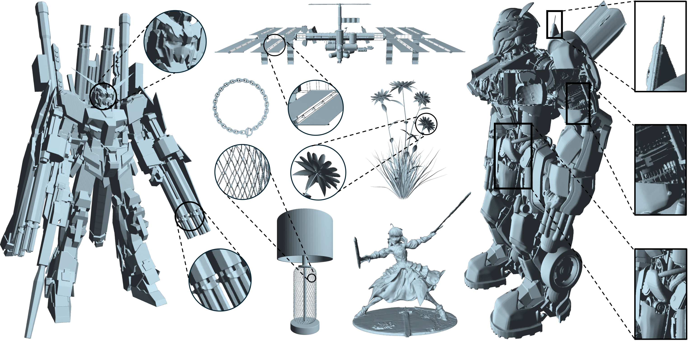

<h1 align="center">
  Sparc3D: Sparse Representation and Construction <br/>for High-Resolution 3D Shapes Modeling
</h1>

<p align="center">
  <a href="https://arxiv.org/abs/2505.14521">
    
  </a>
  <a href="https://lizhihao6.github.io/Sparc3D/">
    
  </a>
  <a href="#">
    
  </a>
</p>

<p align="center">
  
</p>


> We introduce **Sparc3D**, a unified framework that combines a sparse deformable marching cubes representation **Sparcubes** with a novel encoder **Sparconv-VAE**. Sparcubes converts raw meshes into high-resolution (1024³) surfaces with arbitrary topology by scattering signed distance and deformation fields onto a sparse cube, allowing differentiable optimization. Sparconv-VAE is the first modality-consistent variational autoencoder built entirely upon sparse convolutional networks, enabling efficient and near-lossless 3D reconstruction suitable for high-resolution generative modeling through latent diffusion.  


## Citation

If you find this work useful, please cite:

```bibtex
@article{li2025sparc3d,
  title   = {Sparc3D: Sparse Representation and Construction for High-Resolution 3D Shapes Modeling},
  author  = {Li, Zhihao and Wang, Yufei and Zheng, Heliang and Luo, Yihao and Wen, Bihan},
  journal = {arXiv preprint arXiv:2505.14521},
  year    = {2025}
}
